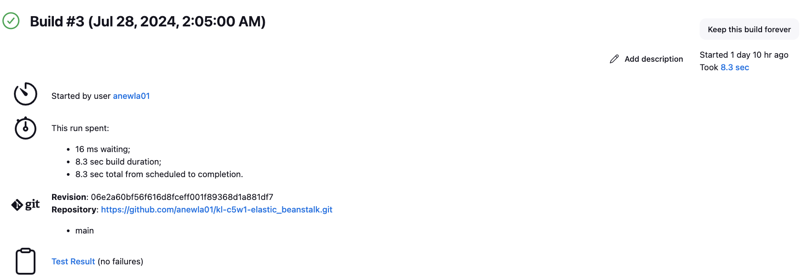
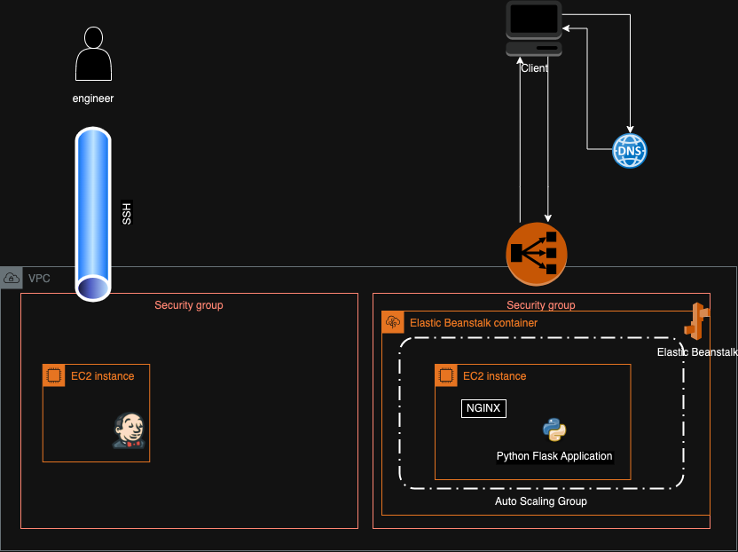

# Overview

Business use case:
A Retail Bank wants to deploy an application to the cloud that is fully managed by AWS. In order to achieve this, their
source code must be uploaded to and configured in AWS Elastic Beanstalk.

This document serves as notes, and reflections on deploying the infrastructure needed to meet the business needs
described above.

Complete Tech Stack:

- Cloud: AWS
- Jenkins: for pipeline build and testing
- Elastic Beanstalk: auto scaling and code deployment to machines
- Application: REST Flask app (Python)

## Purpose:

In this workstream several pieces of infrastructure are deployed by hand to strengthen an understanding of core concepts
in software deployment. Launching an EC2 instance to serve Jenkins, onboarding a git repository to Jenkins, and
deploying this repository (containing a Flask App) onto Elastic Beanstalk. It's important to note that many phases of
this work was completed by hand, which represents a key opportunity for optimization in the future (see section on
Optimizations).

## Tech Stack Key Concepts:

- Jenkins: Jenkins is an incredibly flexible framework, in the context of this application, it serves as a system to 
verify that code can be deployed (this includes testing and building code). Typically Jenkins could be leveraged in 
a businesses CICD pipeline to ensure that code being delivered to production is safe and ready to use.
- Elastic Beanstalk: Managed service provided by AWS to simplify deployment and management of web applications.
    - Beanstalk Environment: A collection of AWS resources running an application. The environment should be configured
      to match the desired needs of the final application. Multiple environments can be spunnup and configured, and each
      can act in isolation, all the while running the same underlying application code.
- Application: For this workstream, the underlying application was pre-provided. Key callouts about this system:
    - A web application built in python using Flask. Storage being done leveraging sqllite.

# Infrastructure Walkthrough

## Installing Jenkins and Connecting Github

[](./docs/resources/successful_build.png)

In order to enable the Jenkins build pipeline, an EC2 instance was configured, launched an deployed and the 
Jenkins service was installed. In general Jenkins serves as a mean to verify t

```bash
# Updating the ubuntu environment 
sudo apt update
# Installing key required packages
sudo apt install fontconfig openjdk-17-jre software-properties-common
# Adding specific repository to enable installation
sudo add-apt-repository ppa:deadsnakes/ppa

# Installing specific version of python needed for underlying application that is being deployed
sudo apt install python3.7 python3.7-venv

# Downloading and installing Jenkins
sudo wget -O /usr/share/keyrings/jenkins-keyring.asc https://pkg.jenkins.io/debian-stable/jenkins.io-2023.key
echo "deb [signed-by=/usr/share/keyrings/jenkins-keyring.asc]" https://pkg.jenkins.io/debian-stable binary/ | sudo tee /etc/apt/sources.list.d/jenkins.list > /dev/null;
sudo apt-get update;
sudo apt-get install jenkins;

# Starting Jenkins and checking the status
sudo systemctl start jenkins;
sudo systemctl status jenkins;
```

### Trouble Shooting

I chose to leverage fine grained permissioning with github, which then lead to some additional trouble-shooting.
Although my builds were successful, a warning message was returned with the following:

```bash
{"message":"Resource not  accessible by personal access token","documentation_url":"https://docs.github.com/rest/commits/statuses#create-a-commit-status","status":"403"}
```

This was resolved leveraging the correct fine grained permissions as follows:

- access to select repository
- Read and Write
    - Repository permissions
    - Actions
    - Commit Statuses (NOTE: this was the one that was missing that led the issue noted above)
    - Deployments
    - Webhooks
- Read ONLY
    - Metadata (mandatory)

## Deploying Elastic Beanstalk (EB)

For this application Elastic Beanstalk provides a one stop shop for deploying a web application accessible via HTTPs.
During provisioning of Elastic Beanstalk several roles were created, the most relevant one to this use case was
`AWSElasticBeanstalkWebTier` which has been pre-configured to allow for traditional web application deployments. Elastic
Beanstalk brings together several AWS resources to allow for the deployment of a web application (see diagram for more 
details)

### Trouble Shooting
A great deal of time (many many many hours) was spent triaging a 502 error that was being thrown due to 
`web: ModuleNotFoundError: No module named 'application'`. Ultimately the root cause of this issue, in my case
came from my `.ebextensions` not being appropriately rolled in the zip file that I was uploading to EB. As it turns out
downloading a repository from githup, and using `zip` does not mean that all files will be appropriately rolled up.


# Diagram
[](./docs/resources/c5w1_elastic_beanstalk_retail_banking_app.drawio.png)


# Conclusion

NOTE: I have not worked with Elastic Beanstalk prior to this engagement. The opinions below are some of my initial
sentiments, compiled after a brief amount of research. In all likelihood, my opinions will change with more testing and
research.

Managed services for cloud infrastructure present a major opportunity for any company that has a need to deploy
applications. Often times these services significantly reduce the level of effort to maintain an application in
production at the trade off of some additional premium. In general these managed services allow for increased
scalability, while reduce maintenance overhead (via reducing friction to enable changes, and maintenance). As with any
technology, inorder to make a complex task simpler to accomplish, there are several layers of abstraction that are
introduced. These layers of abstraction act as both a blessing and a curse. The broad general use cases are accounted
for, however, more complex use cases may not be easily achieved within these managed services, and may force the
technology to into odd anti-patterns, or very length triage as issues require diving through many layers of interfaces.

In the case of Elastic Beanstalk (EB), the end consumer faces no additional premium for leveraging their managed
service, they simply the cost of the underlying resources that they aim to deploy. While your mileage may vary, given
the layout of EB it appears that projects that have a single service that needs to scale horizontally may find success
using EB. For systems that require several discrete workstreams to execute, Elastic Container Service (ECS)
might be a better fit, due to it's capacity to better utilize ECS instances. How EB will perform within your system is
highly dependent on it's configuration as well as the use case.

One callout that became clear throughout this implementation, and is a sentiment that appears to be echo'd throughout
blogs is that EB can be incredibly difficult to debug. Even more painful, its unclear how to provide a meaningful audit
trail for things that go wrong with the underling system. This may present as a major issue for business that have
strong regulatory requirements. Last, but certainly not least, as with any managed service decision, one should be 
mindful of potential vendor lock issues that may arise.

## Discrete Optimizations:

The current deployment could benefit heavily from infrastructure as code. Mor specifically code could be leveraged for
following areas:

- Configuration, deployment, and serving of Jenkins
- Connecting Jenkins build pipelines to the loading of code used for applications within Elastic Beanstalk
- Configuration, and deployment of Elastic Beanstalk

Additionally, from the triage that was experienced, it does appear that more could be done to connect the health state
of the Elastic Beanstalk (EB) environment to the state of the Application. Most notably, the application may serve 5XX
status codes, but the EB environment may still be marked as success. Alternatively, monitoring could be placed on
available
`Service Metric` to provide alerting to operational owners. As this was an initial deployment it's reasonable that no
such monitoring was put in place, however, this is certainly an area for growth in the future.

The underlying Flask Application should be upgraded to Python 3.7 has reached EOL in 2023, which represents key
weakpoint within this stack. AWS has already marked the Platform `Python 3.7 running on 64bit Amazon Linux 2/3.7.1`
as `deprecated`, which is a key risk to the underlying business.

# References

1. [AWS Elastic Beanstalk: when NOT to use it](https://insights.project-a.com/aws-elastic-beanstalk-when-not-to-use-it/)
2. [The Pros and Cons of AWS Elastic Beanstalk: A Thorough Exploration](https://cloudvisor.co/blog/the-pros-and-cons-of-aws-elastic-beanstalk/#:~:text=In%20summary%2C%20while%20AWS%20Elastic,suitability%20for%20particular%20application%20types.)
3. [AWS Elastic Beanstalk — Deploying An Application Using Beanstalk](https://medium.com/edureka/aws-elastic-beanstalk-647ae1d35e2)
4. [Elastic Beanstalk Architecture: AWS Elastic Beanstalk](https://jayendrapatil.com/tag/elastic-beanstalk-architecture/)
5. [AWS: Web server environments](https://docs.aws.amazon.com/elasticbeanstalk/latest/dg/concepts-webserver.html)
6. [AWS: Using Elastic Beanstalk with other AWS services](https://docs.aws.amazon.com/elasticbeanstalk/latest/dg/AWSHowTo.html)


